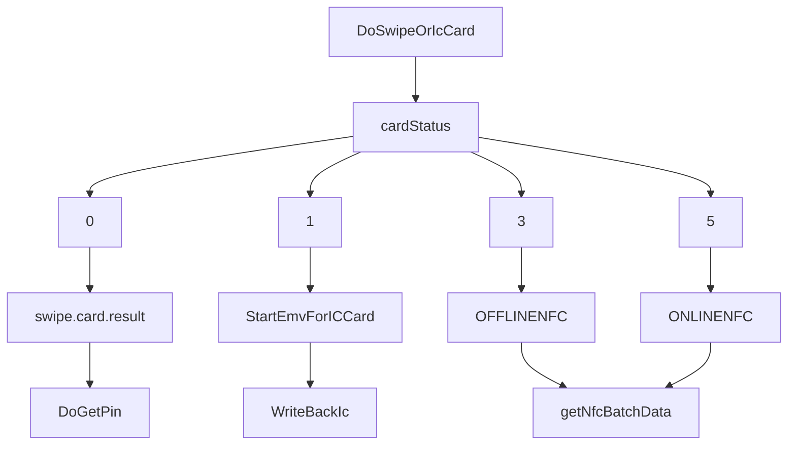

Version | Author        | Date       | Description
--------|---------------|------------|----------------
1.0     | Wenluo Wang   | 2018-03-19 | Initially Added
1.1     | Wenluo Wang   | 2018-03-19 | Added MSR/IC/NFC transaction process description
1.2     | Jianjun guo   | 2020-12-19 | Add Mifare function  

## Linux SDK API List

Bellow is the transaction API list: `Get Device Information/Transaction API]/Handle PIN Input API`

<details>
<summary>Get Device Information API</summary>
<pre> <code>
    int DoGetPosId( char* out );
    int DoGetPosInfo(char *out);
</code> </pre>
</details>

<details>
<summary>Transaction Related API</summary>
<pre> <code>  
    int QueryLatestCommand(char* out);
    int DoSwipeOrIcCard(char* out);
    int StartEmvForICCard(char* out);
    int WriteBackIc(char *script, char *outData);
    int getNfcBatchData(char *out);
</code> </pre> </details>   

<details>
<summary>Handle PIN Input API</summary>
<pre> <code>
    int DoGetPin(char *trade_extra ,char *out );
</code> </pre>
</details>     


## Transaction Flow Chart


**1. Start Transaction - DoSwipeOrIcCard()**   
Before you start transaction, you need set Amount, Currency and Transaction Type:
<details>
<summary>Transaction Parameters.</summary>
<pre>

1.```setAmount()          //set amount for current transaction```

2.```setAmountIcon()      //currency Icon, "$", "USD", "RMB"...```

3.``` tradeMode {         
    //specify transactin interface combo: swipe only, IC only, swipe/IC, swipe/IC/NFC....
    SWIPE_ONLY=0X01,
    ICCARD_ONLY=0X02,
    SWIPE_AND_ICCARD=0X03,
    NOT_ALLOW_DEGRADE=0X04,
    SWIPE_ICCARD_NFC=0X05,
    NFC_NOT_ALLOW_DEGRADE=0X06}```

4.``` MSRDebitCredit_ID {
    INPUT_PIN,  //input pin after swipe
    NO_PIN,     //no pin after swipe}```
    
</pre>
</details>

**2. Transaction Process(cardStatus=0/1/3/5)**   
<details>
<summary>2.1 cardStatus=0  swipe card data retrieve</summary>
<pre> <code>
    // get magnetic strip card track data by `get_key_string(key)`
    dt.get_key_string("FormatId").data()
    dt.get_key_string("CardExpire").data()
    dt.get_key_string("ServiceCode").data()
    dt.get_key_string("CardHolder").data()
    dt.get_key_string("Magic1").toHex()
    dt.get_key_string("Magic2").toHex()
    dt.get_key_string("Magic3").toHex());

    //check the serviceCode , if the card need pin
    DoGetPin(char *trade_extra ,char *out );
    dt.get_key_string("pinKsn").data());
    dt.get_key_string("pinBlock").data());
</code> </pre>
</details> 

<details>
<summary>2.2 cardStatus=1  start EMV kernel for IC card</summary>
<pre> 
<code>
step 1.StartEmvForICCard()
if card status=1, you need call StartEmvForICCard() to start emv kernel to read the IC card.
and choose the approtiate transaction type :
TRADE_TYPE{
    GOODS=0X01,
    CASHBACK=0X04,
    ENQUERY=0X05 }
    
step 2. CmdID= COMPLETED(0X24)
IC reading finish, then you can get the ICC online data, and send to online process

    dt.get_key_string("PinBlock").data()
    dt.get_key_string("CardMask").data()
    dt.get_key_string("IccData").toHex()

step 3. WriteBackIc()
After backend system return authorise code : ARPC. call WriteBackIc(tag 8A+tag 91+tag 71/71) send authorize reply to QPOS
QPOS will send ARPC to ICC card

    char *res="8A023030";
    len=dt.WriteBackIc(res,out);

</code> </pre>
</details> 

<details>
<summary>2.3 cardStatus=3/5  nfc card data retrieve</summary>
<pre> <code>
NFC return equivalent track data+emv tlv online data. 
please retrive track track card track data by `get_key_string(key)` and emv tlv data by getNfcBatchData() 
                   ....
    dt.get_key_string("CardExpire").data()
    dt.get_key_string("ServiceCode").data()
    dt.get_key_string("CardHolder").data()
    dt.get_key_string("Magic1").toHex()
    dt.get_key_string("Magic2").toHex()
    dt.get_key_string("Magic3").toHex());
                   ....
call getNfcBatchData() to get emv online tlv data

     dt.get_key_string("NfcBatchData").toHex()
</code> </pre>
</details> 

## Mifare card Function

|Mifare card Operation:
    1.poll card
    2.vertify card
    3.read card or write card
    4. Finish Transaction

<code>

step 1.Poll call
```
DoMifare(0x01,out); // pull card,Command code:0x01
```

The device returns mifare_cmd, mifare_status, mifare_cardType, mifare_ATQA, mifare_SAK, mifare_cardUid

step 2.vertify card
```
DoMifare(0x02,out); // vertify card,Command code:0x02
```
Before calling the DoMifare (0x02, out) function, you need to set parameters, set key class, block address, cardUid, key
Key class： Key A(0x60) or Key B(0x61)
return :status
step 3.read card or write card
```
DoMifare(0x03,out);//read Card,Command code:0x03
```
You need to set block addr before calling the DoMifare (0x03, out) function
return:mifare_cardData,mifare_status
```
DoMifare(0x04,out) //write Card,Command code:0x04
```
You need to set up block addr, and card data, before calling the DoMifare (0x04, out) function
return :status

4. Finish Transaction
```
DoMifare(0x0e,out)  //Finish Transaction，end mirfare communication,Command code:0x0e
```
return :status

<details>
<summary>The function description</summary>
<pre> <code>

setMifareKeyClass(int keyClass ) //set keyclass
setMifareBlockAddr(int addr )    //set  mifare block Addr
setMifareKeyValue(int cmd )      // set keyvalue
setMifareCardUid(char* cardUid ) // set cardUid
setMifareCardData(char* cardData ) //set card data

</code> </pre>
<details>
<code>


